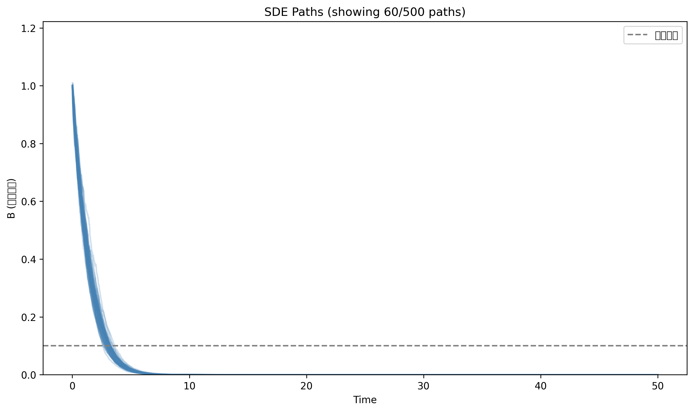
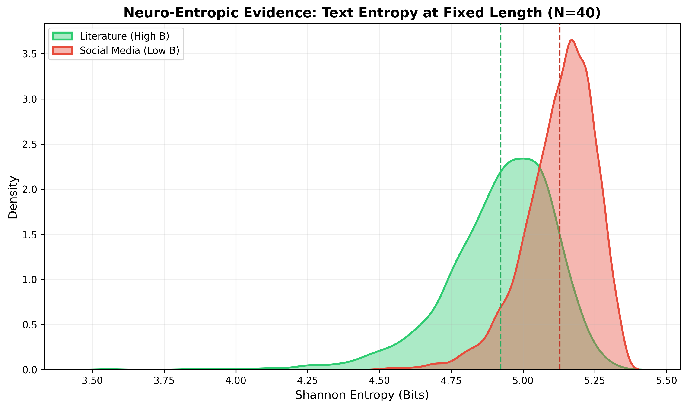
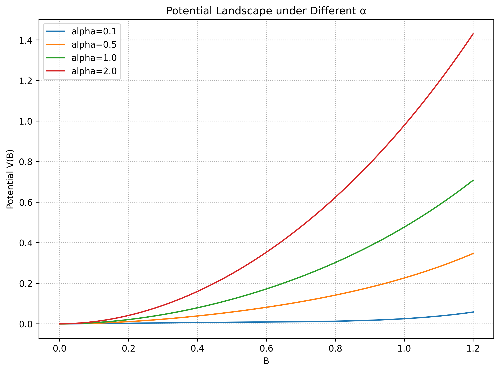
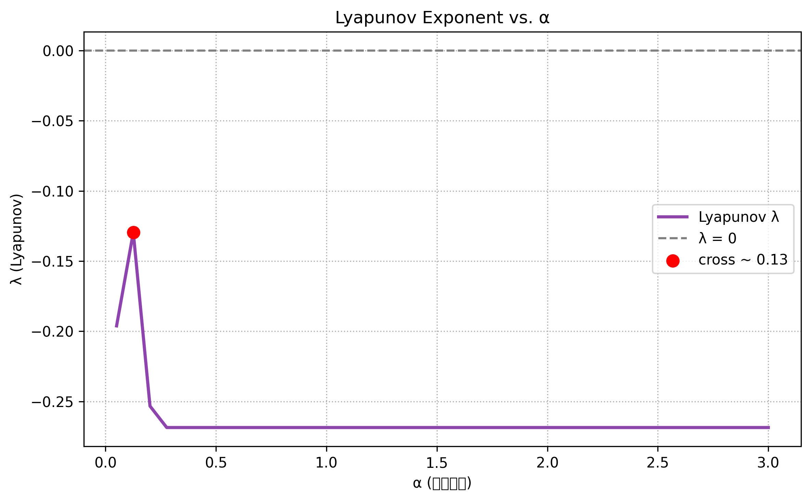
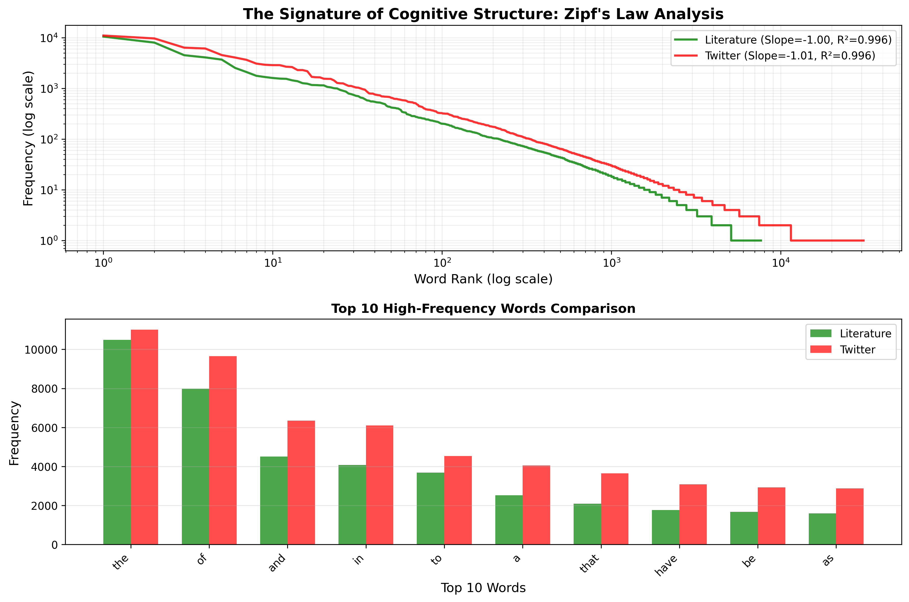
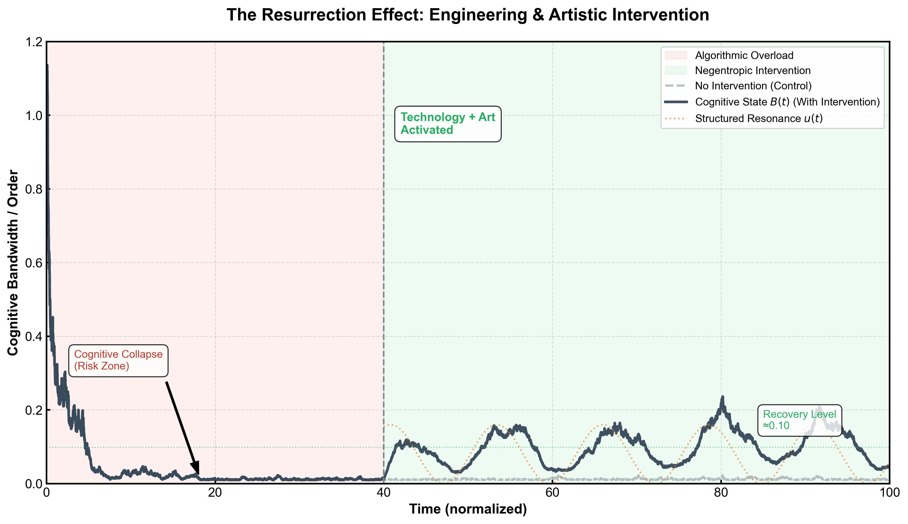

# Neuro-Entropic Extraction Simulator

## Disclaimer

**This repository contains the raw research code for the manuscript "Quantifying Cognitive Collapse".** The scripts were developed for academic simulation and data analysis purposes. As an initial formulation, the code is optimized for mathematical experimentation rather than production efficiency.

---

## Project Description

This project simulates the cognitive dynamics of human attention under algorithmic influence using a multi-layered mathematical model. We combine stochastic differential equations (SDEs), stability analysis, and empirical data validation to quantify how recommendation algorithms extract cognitive bandwidth and reshape neural pathways.

---

## Key Findings

1. **Entropy Gap**: Social media text (Twitter) exhibits **higher unigram entropy** than classical literature when measured at fixed word-length windows, suggesting algorithmic media creates a "chaotic" rather than "structured" cognitive environment.

2. **Optimal Exploitation Threshold**: Parameter sensitivity analysis reveals that algorithms have an **incentive to maintain users in a "semi-stupid" state**—maximizing capital extraction without triggering complete cognitive collapse.

3. **Intervention Efficacy**: Simulated interventions (noise reduction + structured resonance) can reverse cognitive collapse trajectories, demonstrating the potential for engineered countermeasures.

---

## Visual Results

### Stochastic Paths (SDE Simulation)

*Multiple Monte Carlo paths showing cognitive state trajectories under noise. Each path represents an individual's cognitive bandwidth evolution.*

### Entropy Distribution Comparison

*Shannon entropy distributions for Twitter vs. Literature at fixed 40-word windows. The counter-intuitive result (Twitter > Literature) suggests unigram entropy alone is insufficient to capture structural complexity.*

### Potential Landscape

*Potential energy landscape V(B) under different algorithm intensities (α). As α increases, the stable "well" disappears, indicating system collapse.*

### Lyapunov Exponent

*Lyapunov exponent λ vs. algorithm intensity α. The crossing point (λ ≈ 0) marks the cognitive collapse threshold.*

### Zipf's Law Analysis

*Word frequency distributions follow Zipf's law for both corpora, suggesting structural differences manifest at semantic/syntactic levels rather than word frequency.*

### Intervention Simulation

*Demonstration of cognitive recovery through engineered intervention (noise reduction + periodic driving force) at t=40.*

---

## File Structure

### Core Simulation
- **`scipy.integrate.odeint.py`**: Main ODE solver implementing the neuro-entropic model with adaptive algorithm policy
- **`stochastic_simulation.py`**: SDE solver using Euler-Maruyama method with hysteresis effects
- **`stability_analysis.py`**: Potential landscape and Lyapunov exponent calculations

### Data Analysis
- **`data_calibration_v3.py`**: Entropy comparison between Twitter and Literature using Project Gutenberg texts
- **`structural_analysis.py`**: Zipf's law analysis and high-frequency word comparison

### Intervention Studies
- **`intervention_simulation.py`**: Simulates the effect of noise reduction and structured resonance on cognitive recovery

### Utilities
- **`generate_all_figures.py`**: Batch script to generate all publication-quality figures

---

## Dependencies

```bash
pip install numpy scipy matplotlib seaborn pandas nltk
```

---

## Quick Start

1. **Run baseline simulation**:
   ```bash
   python scipy.integrate.odeint.py
   ```

2. **Generate all figures**:
   ```bash
   python generate_all_figures.py
   ```

3. **Run entropy analysis**:
   ```bash
   python data_calibration_v3.py
   ```

---

## Research Context

This work bridges computational neuroscience, information theory, and critical algorithm studies. The model formalizes the hypothesis that recommendation algorithms create a "neuro-entropic extraction" process, where user attention is systematically converted into digital capital while degrading cognitive bandwidth.

---

## Citation

If you use this code in your research, please cite:

```
Neuro-Entropic Extraction Simulator v0.1
Quantifying Cognitive Collapse: A Mathematical Model of Algorithmic Attention Extraction
```

---

## License

Research code—use at your own discretion. This is academic exploration code, not production software.

